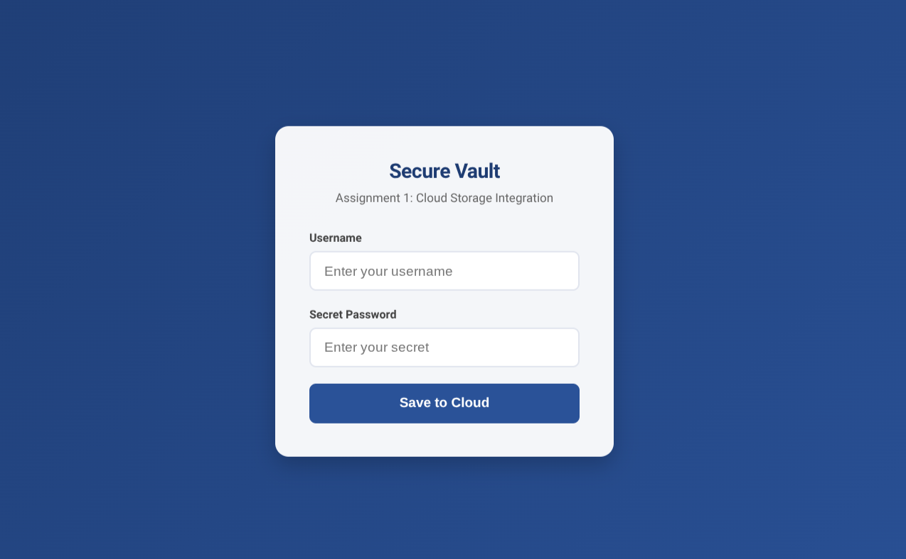

# Secure Cloud Data Vault
#### A secure, 3-tier web application for archiving sensitive user data to Google Cloud Storage.


## Overview
This project demonstrates a **production-grade cloud architecture** designed to securely capture user credentials and store them in a private Google Cloud Storage bucket.

Unlike simple "Hello World" apps, this solution implements:
* **Reverse Proxying:** Nginx shields the backend from the public internet.
* **Identity Access Management (IAM):** Uses a restricted Service Account with the Principle of Least Privilege.
* **Data Sanitization:** robust input validation to prevent injection attacks.

---

## Architecture

The system follows a **Microservices approach** hosted on a Google Compute Engine VM.

`User (Browser)` ➡ `Nginx (Port 80)` ➡ `Node.js (Port 3000)` ➡ `Google Cloud Storage`

| Component | Technology | Role |
| :--- | :--- | :--- |
| **Frontend** | HTML5, CSS3 (Glassmorphism), JS | Provides the user interface and client-side validation. |
| **Proxy** | **Nginx** | Acts as a Reverse Proxy/Gateway. Handles SSL and static files. |
| **Backend** | **Node.js (Express)** | Handles API requests, input sanitization, and IAM authentication. |
| **Storage** | **Google Cloud Storage** | Private object storage for archiving JSON data. |

---

## Key Features
* **Security First:** The backend API is not exposed publicly. Nginx routes traffic securely.
* **Zero-Key Authentication:** Uses **Application Default Credentials (ADC)**. No hardcoded API keys or `.json` files are stored in the code.
* **Restricted Identity:** The VM runs as a `web-uploader` service account that can **only write** to the bucket, not read or delete existing files.
* **Modern UI:** A responsive, clean interface with real-time feedback.

---
## Webpage View 


---

## Installation & Setup

### Prerequisites
* A Google Cloud Platform (GCP) Project.
* A Compute Engine VM (Debian/Ubuntu).
* A Cloud Storage Bucket.

### 1. Infrastructure Setup
1.  Create a **Service Account** (e.g., `web-uploader`).
2.  Grant it the role **"Storage Object Creator"** on your bucket.
3.  Create a VM and attach this Service Account to it.
4.  Allow **HTTP traffic** in the firewall settings.

### 2. Environment Setup (On the VM)
```bash
# Update and install dependencies
sudo apt-get update
sudo apt-get install -y nginx git unzip
```
```bash
# Install Node.js v24 (LTS)
curl -fsSL https://deb.nodesource.com/setup_24.x | sudo -E bash -
sudo apt-get install -y nodejs
```

### 3. Deployment


#### Clone the repository
```bash
git clone https://github.com/priyanshuNegi-work/cloud-assignment-1.git
```
#### Install Node.js dependencies
```bash
npm install
```
#### Start the Backend Server (Background Mode)
```bash
node server.js &
```
### 4. Configure Nginx (Reverse Proxy)

Edit your Nginx config (`/etc/nginx/sites-available/default`) to route `/api` traffic to `localhost:3000`.

```nginx
server {
    listen 80;
    location / {
        root /path/to/project;
        try_files $uri $uri/ =404;
    }
    location /api/ {
        proxy_pass http://localhost:3000;
    }
}
```

### Restart Nginx:

```bash
sudo systemctl restart nginx
```

---

## Testing
1. Open your browser and navigate to your VM's **External IP**.
2. Enter a Username and Password.
3. Click **Save to Cloud**.
4. Check your Google Cloud Storage Bucket to verify the file was created.

---
